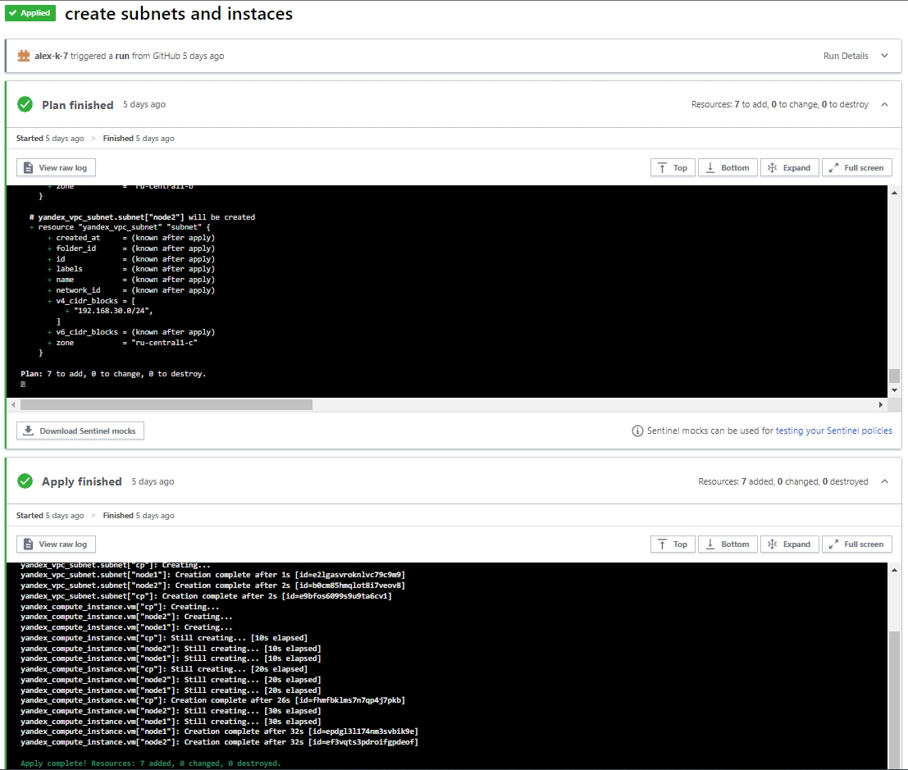
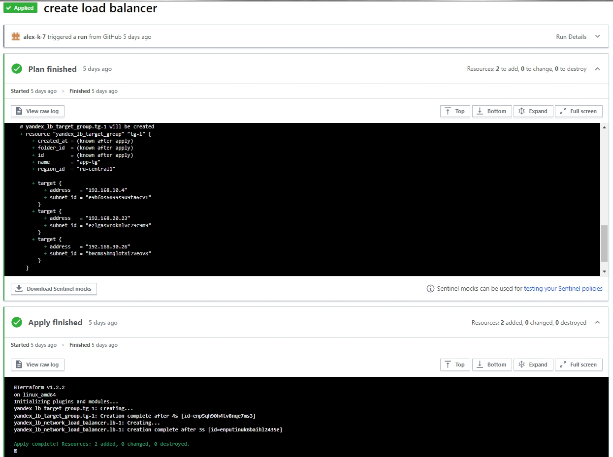

## Создание инфраструктуры для кластера Kubernetes в Yandex Cloud с помощью Terraform.

Конфигурация - [main.tf](main.tf).

Предварительно в Yandex Cloud были созданы отдельная директория для проекта, сервисный аккаунт для работы с данной директорией, а также авторизованный ключ для работы Тerraform от имени сервисного аккаунта. Для выполнения задачи в качестве backend был выбран Terraform Cloud. Workspace подключен к github [репозиторию](https://github.com/alex-k-7/diplom-terraform). В Terraform Cloud указаны переменные "YC_SERVICE_ACCOUNT_KEY_FILE", "CLOUD_ID" и "FOLDER_ID".

